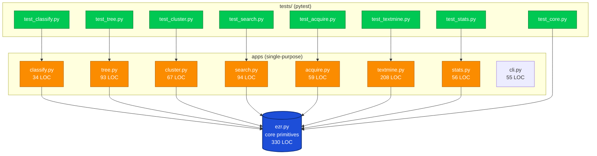

[](https://github.com/timm/ezr/tree/26mar)


# EZR(1) - Explainable Multi-Objective Optimization

## NAME

**ezr** — explainable multi-objective optimization via decision trees,
clustering, Naive Bayes, and active learning

## SYNOPSIS

    ezr APP [OPTIONS] [FILE]
    python -m ezr.<app> [OPTIONS] [FILE]
    pytest tests/ [-v] [-k PATTERN]

## DESCRIPTION

**ezr** is a lightweight toolkit for multi-objective optimization
and explainable AI. It summarizes CSV data into Num/Sym columns,
builds decision trees that minimize distance to ideal outcomes,
clusters rows via k-means or recursive halving, and supports
active learning with Naive Bayes or centroid-based acquisition.

**ezr** is an experiment in "how low can you go?". i.e. how little
data do you need for effective AI. THe code using active learning
to label a small number of (say) 50 informative examples. These are
used to build a regression tree which, in turn, is used to sort the
unlabelled test data. Repeated studies show that by labelling the
first (say) 5 examples, then the selected row optimzies as well or
better than the conclusions mae by state of the art optimizers SMAC
(which runs two orders of magnitice slower than **ezr**).


Input is CSV. The header row defines column roles:

    [A-Z]*    Numeric (e.g. "Age")
    [a-z]*    Symbolic (e.g. "job")
    [A-Z]*+   Maximize goal (e.g. "Pay+")
    [A-Z]*-   Minimize goal (e.g. "Cost-")
    [a-z]*!   Class label (e.g. "sick!")
    *X        Ignored (e.g. "idX")
    ?         Missing value (in data rows, not header)

The codebase is a small core plus a handful of single-purpose
app files, each living on top of `ezr.py`:

- **ezr.py** — core primitives (Num/Sym columns, Data, csv,
  distance, like/likes, mid/spread, pick, extrapolate, wins, the)
- **classify.py** — Naive Bayes (incremental test-then-train)
- **tree.py** — decision/regression trees, treeShow, treePlan
- **cluster.py** — kmeans, kmeans++, rhalf
- **search.py** — sa, ls, de, oneplus1, oracleNearest
- **acquire.py** — active learning (Bayes + centroid acquisition)
- **textmine.py** — tokenize, stem, tfidf, CNB, active CNB
- **stats.py** — sames, cliffs, confused
- **tests/** — pytest test suite, one file per app

Apps depend only on `ezr.py` (star topology, no app-to-app imports).
Tests live outside the package and import core + the app under test.



Star network: every arrow points down to `ezr.py`. No sideways arrows
between apps. Tests fan in to the apps they exercise.

Total app+core+cli = 996 LOC (excluding tests). Tests in `tests/`
discover via pytest: 42 tests across 8 files, all assert.

## INSTALLATION

### Option A: Install as a package

    git clone http://github.com/timm/ezr
    cd ezr
    pip install -e .

This creates the global `ezr` command. Edits to any
core or app file take effect immediately.

    ezr --help
    ezr tree auto93.csv
    ezr classify diabetes.csv
    ezr search de auto93.csv --budget=256

To uninstall:

    pip uninstall ezr

### Option B: Run from the directory

    git clone http://github.com/timm/ezr
    cd ezr
    python -m ezr.cli --help
    python -m ezr.tree auto93.csv

No installation required. Just needs Python 3.12+.

### Sample data

    mkdir -p $HOME/gits
    git clone http://github.com/timm/moot $HOME/gits/moot

## COMMANDS

Each subcommand dispatches to a single app:

    ezr classify FILE       NB + decision tree + ZeroR baseline
    ezr tree FILE           Grow regression tree (Rung 1: association)
    ezr tree --funny FILE   Flag rows where leaf disagrees with truth (Rung 2)
    ezr tree --plan FILE    Counterfactual plans for the worst row (Rung 3)
    ezr cluster FILE        Run clustering benchmark (kmeans, kpp, rhalf)
    ezr search sa FILE      Simulated annealing
    ezr search ls FILE      Local search
    ezr search de FILE      Differential evolution (NP=30)
    ezr search compare FILE Compare sa vs ls vs de
    ezr acquire FILE        Active learning train/predict/score pipeline
    ezr textmine FILE       CNB text classification

## OPTIONS

Options update the global configuration. Use `--key=value` syntax.

### Learning & Trees

    --learn.leaf=3      Minimum examples per leaf
    --learn.budget=50   Number of rows to evaluate
    --learn.check=5     Number of guesses to check
    --learn.start=4     Initial number of labels

### Distance & Bayes

    --p=2               Distance metric (1=Manhattan, 2=Euclidean)
    --bayes.m=2         m-estimate for Naive Bayes
    --bayes.k=1         k-estimate (Laplace smoothing)
    --few=512           Max unlabelled rows in active learning

### Statistics

    --stats.cliffs=0.195  Cliff's Delta threshold
    --stats.conf=1.36     KS test confidence coefficient
    --stats.eps=0.35      Margin of error multiplier

### Display

    --seed=1            Random number seed
    --show.show=30      Tree display width
    --show.decimals=2   Decimal places for floats

Options and commands can be interleaved. Options apply to
all subsequent commands:

    ezr --seed=42 --learn.budget=30 --test auto93.csv --see auto93.csv

## TESTING

### Run all tests

    pip install pytest
    pytest tests/ -v

### Run a single test file

    pytest tests/test_tree.py -v

### Run a single test by name

    pytest tests/ -k test_classify

### Test files (one per app)

    tests/test_core.py      Num, Sym, csv, Data, Cols, distx, disty, mid, spread,
                            entropy, pick, picks, extrapolate, addsub, thing, nest, the
    tests/test_classify.py  NB vs Tree vs ZeroR (90/10 split, 20 reps, asserts > ZeroR)
    tests/test_tree.py      tree, see, funny (Rung 2), plan (Rung 3)
    tests/test_cluster.py   kmeans, kpp, rhalf benchmarks
    tests/test_search.py    sa, ls, de (asserts final energy < initial)
    tests/test_acquire.py   acquire, acquire1, acquire3 (asserts wins > random)
    tests/test_textmine.py  cnb_like, cnb_sweep, cnb_data, cnb_active,
                            tokenize, nostop, stem, tfidf
    tests/test_stats.py     sames, cliffs, confused

## LIBRARY USAGE

**ezr.py** exports everything needed to use the toolkit
programmatically:
```python
from ezr import *

d = Data(csv("auto93.csv"))
win = wins(d)
t = treeGrow(d, d.rows)
treeShow(t)

for r in sorted(d.rows, key=lambda r: disty(d, r))[:5]:
    print(win(r), r)
```

This generates the following where _D_ is distance to heaven (lower values are better),
_n_ is the number of examples in that branch, and _goals_ shows the rows in that branch.

```
$ ezr --tree ~/gits/moot/optimize/misc/auto93.csv
                               D       N     Goals
                               ====  =====   =====
                              ,0.66 ,( 50), {Acc+=15.51, Lbs-=2888.64, Mpg+=24.60}
Clndrs <= 5                   ,0.61 ,( 26), {Acc+=16.43, Lbs-=2204.46, Mpg+=30.38}
|   Volume <= 98              ,0.59 ,( 14), {Acc+=17.15, Lbs-=2024.64, Mpg+=33.57}
|   |   Volume <= 91          ,0.59 ,(  9), {Acc+=17.09, Lbs-=1927.67, Mpg+=35.56}
|   |   |   origin != 3       ,0.58 ,(  4), {Acc+=17.35, Lbs-=1908.00, Mpg+=37.50}
|   |   |   origin == 3       ,0.59 ,(  5), {Acc+=16.88, Lbs-=1943.40, Mpg+=34.00}
|   |   Volume > 91           ,0.60 ,(  5), {Acc+=17.26, Lbs-=2199.20, Mpg+=30.00}
|   Volume > 98               ,0.64 ,( 12), {Acc+=15.58, Lbs-=2414.25, Mpg+=26.67}
|   |   origin != 2           ,0.61 ,(  5), {Acc+=15.64, Lbs-=2344.00, Mpg+=30.00}
|   |   origin == 2           ,0.66 ,(  7), {Acc+=15.54, Lbs-=2464.43, Mpg+=24.29}
Clndrs > 5                    ,0.72 ,( 24), {Acc+=14.52, Lbs-=3629.83, Mpg+=18.33}
|   origin != 1               ,0.63 ,(  3), {Acc+=14.93, Lbs-=3000.00, Mpg+=26.67}
|   origin == 1               ,0.73 ,( 21), {Acc+=14.46, Lbs-=3719.81, Mpg+=17.14}
|   |   Volume <= 302         ,0.71 ,( 12), {Acc+=15.88, Lbs-=3385.92, Mpg+=19.17}
|   |   |   Clndrs <= 6       ,0.71 ,(  8), {Acc+=16.94, Lbs-=3308.25, Mpg+=20.00}
|   |   |   |   Model <= 75   ,0.71 ,(  5), {Acc+=16.20, Lbs-=3219.40, Mpg+=20.00}
|   |   |   |   Model > 75    ,0.71 ,(  3), {Acc+=18.17, Lbs-=3456.33, Mpg+=20.00}
|   |   |   Clndrs > 6        ,0.73 ,(  4), {Acc+=13.77, Lbs-=3541.25, Mpg+=17.50}
|   |   Volume > 302          ,0.75 ,(  9), {Acc+=12.57, Lbs-=4165.00, Mpg+=14.44}
|   |   |   Model > 73        ,0.71 ,(  3), {Acc+=13.37, Lbs-=4171.33, Mpg+=20.00}
|   |   |   Model <= 73       ,0.76 ,(  6), {Acc+=12.17, Lbs-=4161.83, Mpg+=11.67}
```


Key exports — **core (`ezr.py`)**: `Data`, `Num`, `Sym`, `Col`, `Cols`,
`adds`, `add`, `sub`, `clone`, `mid`, `spread`, `mode`, `entropy`,
`norm`, `distx`, `disty`, `nearest`, `like`, `likes`, `wins`,
`pick`, `picks`, `extrapolate`, `csv`, `o`, `table`, `nest`, `thing`, `the`.

**Apps**:
- `tree.py`: `Tree`, `treeGrow`, `treeCuts`, `treeSplit`, `treeLeaf`,
  `treeNodes`, `treeShow`, `treePlan`
- `classify.py`: `classify` (incremental NB)
- `cluster.py`: `kmeans`, `kpp`, `rhalf`
- `search.py`: `oneplus1`, `sa`, `ls`, `de`, `oracleNearest`
- `acquire.py`: `acquire`, `warm_start`, `acquireWithBayes`, `acquireWithCentroid`
- `stats.py`: `sames`, `cliffs`, `confused`, `dinc`
- `textmine.py`: `tokenize`, `nostop`, `stem`, `tfidf`, `cnb`, `cnbLikes`,
  `text_mining`, `active`

## FILES

    ezr/
      ezr.py          Core primitives (~200 LOC)
      classify.py     Incremental Naive Bayes
      tree.py         Regression and decision trees, plans, anomalies
      cluster.py      kmeans, kmeans++, rhalf
      search.py       sa, ls, de, oneplus1
      acquire.py      Active learning (Bayes + centroid)
      textmine.py     Tokenize, stem, tfidf, CNB
      stats.py        sames, cliffs, confused
      cli.py          Subcommand dispatcher
    tests/            One test_<app>.py per app, plus conftest.py
    pyproject.toml    Package config (ezr binary entry, version, deps)
    README.md         This file
    CHANGELOG.md      Release notes
    LICENSE.md        MIT

## AUTHOR

Tim Menzies <timm@ieee.org>, 2026. MIT License.

## SEE ALSO

- Repository: http://github.com/timm/ezr
- Sample data: http://github.com/timm/moot
