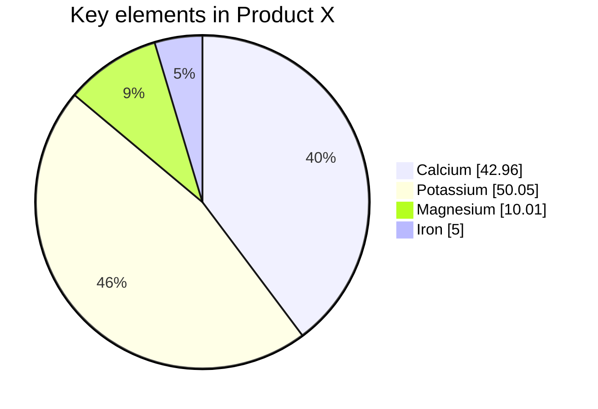

% Intro SE 4 AI
% Tim Menzies
% March 22, 2024

# What? 

{ width=300px }  

- We explores theory/ construction / evaluation of variants of active learners
- We apply those algorithms to the multi-objective optimization SE problems[^data]
- These algorithms   are
  - Incredibly simple to code
  - Can include human-in-the-loop supervision
  - Can make decisions about seemingly complex problem, using 20-40 examples.
- Our dangerous idea:
  - How many complex problems....  aren't?
  - Why aren't more people talking more about this stuff?

[^data]: [https://github.com/timm/ezr/tree/main/data](https://github.com/timm/ezr/tree/main/data)

# Why? (1)

Why study the use of less data/ active learning/  optimization ?

- Cause almost no one else is studying reasoning with very little data
- Cause we are getting really really good at reasoning with very little data
- Cause its good science
  - If you really understand "it", can you do "it" again, very very simply
- Cause the world is changing
  - Next generation of satellite internet providers
  - Connecting millions of new programmers willing to work for $\frac{1}{20}$th of the salary you want
  - In that world, you do not want to be the programmer
  - You want to be the optimizer who controls and improves the work of others.

# Why? (2)

Why study the use of less data/ active learning/  optimization ?

- Cause big data is  running out of data (see next slide).
- Cause everyone has gone mad on complexity.
  - A small number of very large companies  have built empires based on "big data"
  - Five years ago, no on one wanted to head about simplicity
  - But after three years of constant tech lay offs, and increasing challenges for getting jobs at these large
organizations ...
  - ... my students now know they need to graduate with knowledge about "big data" AND alternate approaches.

# Surfing the long tail

- LLMs for specific problems?
  - LLMs  know a lot, about things we do a lot (e.g.  "if" statements in code)
  - And they know _less_ about things we do _less_ often
- Model collapse: 
  - We are about to run out of training data [^less24] for LLMs.
  - Can't reply of synthetic data generation (no new information from data already seen)
- So,  we make do with _less_ data?
  - Are their domain,  were models need less, not more, data?

[^less24]:  Udandarao, V., Prabhu, A., Ghosh, A., Sharma, Y., Torr, P.H., Bibi, A., Albanie, S. and Bethge, M., 2024.  No" zero-shot" without exponential data: Pretraining concept frequency determines multimodal model performance. arXiv preprint arXiv:2404.04125.

# Aside: Q: What is Software Engineering?

- A: The delivery and maintainable of software products to an acceptable standard, built using
    current constraints.
- Are LLMs building  "quality" solutions? 
  - Do the respect the  "current constraints"?
- Do LLMs work for all tasks?  
  - Not really[^hype].  They often produce useful suggestions.  But mixed in with the good is also the bad, the terrible, the misleading and the dangerous[^hype].
- Bad science? 
  - Research  papers can no longer repeat  an LLM analysis, say, 20 times and report the variability in the results
  - Other researchers can not longer reproduce and check results (from the big companies)
- Need too much energy? 
  - AI's needs are growing from  1% of world's power, creating 4% of our carbon emissions[^durmus]
- Need too much data intensive? (see next page) 
- Are there other options? That use less data? That can be tested?

[^durmus]: [www.linkedin.com/pulse/data-centers-its-environmental-impacts-i%C5%9F%C4%B1l-durmu%C5%9F-q5xvf/](https://www.linkedin.com/pulse/data-centers-its-environmental-impacts-i%C5%9F%C4%B1l-durmu%C5%9F-q5xvf/)
[^hype]: [docs.google.com/document/d/1dF4GePCf04IW5uZnRSGQXRlzo5VyD5u0PQ3hfy-Zd6Q/edit](https://docs.google.com/document/d/1dF4GePCf04IW5uZnRSGQXRlzo5VyD5u0PQ3hfy-Zd6Q/edit).

#  Application of Little Data in SE: Software Review 

{ width=300px }  

- The more we use AI in SE, the more code will be auto-generated. 
- The more we auto-generate code
  - the less time software engineers spend writing and reviewing new code, written by someone
    or something else (which internally, are a mystery)
- The less we understand code, 
  - the more we will use black-boxes components, where, once a system is assembled, its control settings are tuned. 

In this scenario: we must reduce the effort (human and CPU) for that tuning.

# More on Software Review

- We define “software review” as a panel of SMEs (subject matter experts),
  looking at examples of behavior to recommend how to improve software.
- SME time is usually very limited so, such reviews must complete after 
  looking at just a small number of very informative examples. 
- To support the software review process, we explore methods that train 
  a predictive model to guess if some oracle will like/dislike the next example. 
- These predictive models work with SMEs to guide them as they explore the examples. Afterwards, the models
  can handle new examples, while the panelists are busy, elsewhere

# Q: How few questions can humans answer? A: Not so many

What | N
----:|-------
Standard theory |  more is always better
Cognitive Science | 7 plus or minus 2
From human studies (cost estimation, rep grids)[^smith80]  |  10 to 20 examples per 1-4 hours
Regression [^quora] | 10-20 examples per attribute
Semi-supervised learning | $\sqrt{N}$
Zhu et al.[^zhu16] | 100 images
Menzies et al. 2008[^Me08] | 50 examples
Chessboard model[^me05]   | 200 examples
Probable Correctness theory[^ham89] | simpler cases: 50 to 6 (if binary chop) 
|                             | safety-critical cases: 272 to 8 (ifbinary chop)
 
[^quora]: www.quora.com/How-many-data-points-are-enough-for-linear-regression
[^zhu16]: Zhu, X., Vondrick, C., Fowlkes, C.C. et al. Do We Need More Training Data?.  Int J Comput Vis 119, 76–92 (2016). https://doi-org.prox.lib.ncsu.edu/10.1007/s11263-015-0812-2

[^Me08]: Menzies, T., Turhan, B., Bener, A., Gay, G., Cukic, B.,  PROMISE workshop, 2008, (pp. 47-54).

[^me05]: J. Nam, W. Fu, S. Kim, T. Menzies and L. Tan, "Heterogeneous Defect Prediction," in IEEE Transactions on Software Engineering, vol. 44, no. 9, pp. 874-896, 1 Sept. 2018, doi:

[^ham89]: My personnel reading of Richard G. Hamlet. 1987. Probable correctness theory. Inf. Process. Lett. 25, 1 (20 April 1987), 17–25. https://doi.org/10.1016/0020-0190(87)90088-3

[^smith80]: M. Easterby-Smith, Design, analysis and interpretation of repertory grids, International Journal of Man-Machine Studies, 13(1), 1980, 3-24,

# Tricks: Often cheaper, faster, to find "X" than "Y"

- $Y=f(X)$
  - $X$,$Y$ are our independent and dependent variables.
  - $f$ is the thing we are trying to find
- e.g. Fishing: 
  - Glance up and down the river. 
  - That looks like a good spot. 
  - 3 hours later:  well, it was not
- e.g. Used car yard: 
   -  Glancing over 100 cars:  count the cars and their colors and number of wheels and size of car.
   -  But to find gas mileage-- got to take each out for a long drive.

# SE Examples where finding $X$ is  cheaper than $Y$

- $X$,$Y$ are our independent and dependent variables.
- Quick to mine $X$ GitHub to get code size, dependencies per function,  
  - Slow to get $Y$ (a) development time, (b) what people will pay for it
- Quick to count $X$ the number of classes in a system. 
  - Slow to get  $Y$ an organization to tell you human effort to build and maintain that code.
- Quick to enumerate $X$ many  design options (20 yes-no = $2^{20}$ options) 
  - Slow to check $Y$ those options with   the human stakeholders.
- Quick to list $X$ configuration parameters for  the  software. 
  - Slow to find $X$ runtime and energy requirements for all configurations.
- Quick to list $X$ data miner params (e.g. how many neighbors in knn?) 
  - Slow to find  $Y$ best setting for local data. 
- Quick to  make $X$ test case inputs using (e.g.) random input selection
  - Slow to run all tests and  get $Y$ humans to check each output 

# This is called "Active Learning"

- Learning works better if the learner can pick its training data[^brochu].
Given two models that predict for good $g$ or bad $b$:
- An active learning loop:

# An Active Learning Loop

- _Labelling_: given an example with $X$, but not $Y$, get the $Y$.
- Just for simplicity, assume we a model can inputs $X$ values to predict for good $g$ or bad $b$:

|n|Task | Notes|
|-:|-----|------|
|1|Sample a little  | Get a get a few $Y$ values (picked at random?) |
|2|Learn a little   | Build a tiny model from that sample|
|3| Reflect | Compute $b,r$|
|4| Acquire         | Label an example that (e.g.) maximizes $b/r$. Add it to the sample|
|5| Repeat          | Goto 2|

How to 
- Sample, once
  - Use reflection to find one unlabelled thingFind &$ the $X$ variables, 
  - guess what might be the next most informative example
  - get its $Y$ value, .

# Three kinds of active learning

#
# adas

[.column]

### The First column

[.column]

### Second column.

# aasdas

asdada

