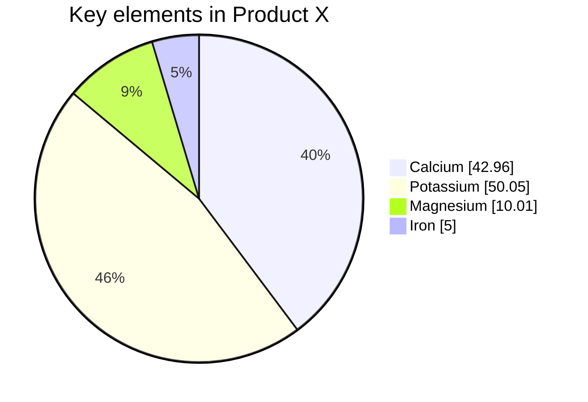

% Intro SE 4 AI
% Tim Menzies
% March 22, 2024

#  Issues with SE 4 AI

- The more we use AI in SE, the more code will be auto-generated. 
- The more we auto-generate code, the less time software engineers 
  spend writing and reviewing new code, written by someone or something
  else (the internals of which they may not understand).
- The less we understand code, the more we will use black-boxes components,
  where, once a system is assembled, its control settings are tuned. 
- In this scenario, it becomes very important to reduce the human effort
  and CPU effort required for that tuning.

# Software Review

- We define “software review” as a panel of SMEs (subject matter experts),
  looking at examples of behavior to recommend how to improve software.
- SME time is usually very limited so, such reviews must complete after 
  looking at just a small number of very informative examples. 
- To support the software review process, we explore methods that train 
  a predictive model to guess if some oracle will like/dislike the next example. 
- These predictive models work with SMEs to guide them as they explore the examples. Afterwards, the models
  can handle new examples, while the panelists are busy, elsewhere

# How many questions can we ask a human?

What | N
----:|-------
Standard theory: |  more is always better
Cognitive Science: | 7 plus or minus 2
From human studies (cost estimation, rep grids) : |  10 to 20 examples per 1-4 hours
Regression theory| 10 examples per attribute
Semi-supervised learning | $\sqrt{N}$
Zhu et al. [^zhu16] | 100 images
Menzies et al. 2008 [^Me08] | 50 examples
Chessboard model    | 200 examples
Probable Correctness theory | simpler cases: 50 to 6 (if we can binary chop)  safety-critical cases: 272 to 8 (if we can binary chop)<
 

[^zhu16]: Zhu, X., Vondrick, C., Fowlkes, C.C. et al. Do We Need More Training Data?. 
Int J Comput Vis 119, 76–92 (2016). https://doi-org.prox.lib.ncsu.edu/10.1007/s11263-015-0812-2

[^Me08]: Menzies, T., Turhan, B., Bener, A., Gay, G., Cukic, B., &
predictors. In Proceedings of the 4th international workshop on
Predictor models in software engineering (pp. 47-54).

# Maths: Gasussians

# Maths: Probabi;ity Theory

- Confidence $C$ to see an event at prob.  $p$ after $n$ trials $C = (1 - p)^n$.
  - So $n = \frac{log(1-C)}{log(1-p)}$
- If we have any tricks for order examples best to worst, we can do a binary chop
  - So $n = log_2\left( \frac{log(1-C)}{log(1-p)}\right)$
- Guassians 

# adas

[.column]

### The First column

[.column]

### Second column.

# aasdas

asdada

