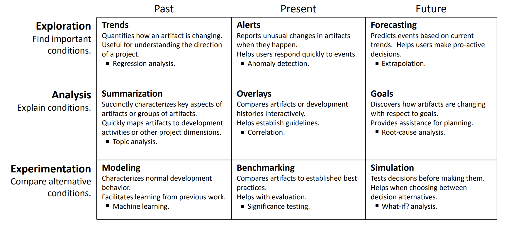

# Introduction: All you Need is Less
 ## from chatgtp

In recent years, large language models (LLMs) have demonstrated
impressive capabilities in natural language processing tasks.
However, their reliance on vast amounts of data and computational
resources poses significant challenges. These challenges include
the environmental impact of high energy consumption, the economic
cost of maintaining extensive computational infrastructure, and the
ethical concerns associated with data privacy and accessibility.

Given these concerns, exploring data-light alternatives presents a
compelling avenue for research. Data-light methods prioritize
efficiency and sustainability, making them more accessible and
feasible for a broader range of applications, especially in
resource-constrained environments. By focusing on optimizing
performance with minimal data, these approaches can offer innovative
solutions that are both cost-effective and environmentally friendly.

Moreover, data-light alternatives can enhance robustness and
generalizability. By reducing dependence on large datasets, these
methods are less susceptible to biases and overfitting, resulting
in models that perform reliably across diverse scenarios. This
aligns with the growing emphasis on ethical AI development, ensuring
that advancements in artificial intelligence are inclusive and
equitable.

In summary, while LLMs have their merits, the exploration of
data-light alternatives addresses critical issues of sustainability,
accessibility, and ethical considerations. This research aims to
contribute to the development of efficient and responsible AI
technologies, paving the way for a more sustainable and inclusive
future in artificial intelligence.

## from me
Suppose we want to use data to make decisions about what to do,
what to avoid, what to do better, etc etc. How to do that?

This process is called _analytics_, i.e. the reduction of large
amounts of low-quality data into tiny high-quality statements. Think
of it like "finding the diamonds in the dust".  For example, in one
survey of managers at   Microsoft, researchers found many kinds  of
analytics functions [^buse]. As shown in the following table, those
functions include regression, topic analysis, anomaly detection,
what-if analysis, etc:

[^buse]: Buse and zimemrmann, info neeeds

But is analytics as complicated as all that? Are all these functions
really different or do they share a common core? And if they share
a common core, does that mean if we coded up, say, regression then
everything could be coded very quickly?  More importantly, if we
found someway to optimize that core, would that optimization apply
to many kinds of analytics?

We think so.  We've been working on applications of analytics for
decades. In that work, we've explored data--driven
applications in spacecraft control, fairness, explanation,
configuration, cloud computing,  security, literature reviews,
technical  debt,  vulnerability prediction, defect prediction,
effort estimation,  and the management of open source software
projects. And in all that work, one constant has been the  
_compressability_ of the data:

- Many data sets can be pruned down to a surprisingly small set of rows and columns,
without loss of signal.
- In that compressed space, modeling becomes more manageable and
all our functions algorithms run faster (since there is less to
explore).
- Also, data becomes private since we threw away so much in the
compression process.
- Further, explanation is easier since this there is less to explain.
This means, in turn, that is easier to understand/ audit/critique
our solutions.

We are not the first to say these things.  For example, many
researcher accept that higher dimensional data can often be reduced
to a _lower dimensional latent manifolds_ inside that
high-dimensional space [^zhu2005semi].  As a consequence, many
data sets that appear to initially require many variables to describe,
can actually be described by a _comparatively small number of variables_.

[^zhu2005semi]: ss

## Why do we need it

data scarcity:
what happens if you start working in the long tail:
No “Zero-Shot” Without Exponential Data: Pretraining Concept
Frequency Determines Multimodal Model Performance
https://arxiv.org/pdf/2404.04125

human cognitive limits 7+- 2

data errors:
the bad labeling problem

# Why does it work?

The results of this code are strage: large problem spaces can be explored with just a few queries.
Which is odd since conventional wisdom is that learnign requires a lot of data:

TABLE

so we are cheating int aht we are handling asoewhat special case:

- Not ebst, jsut one statistical indistinguishable from best
- not n good but one good
- optimzation, not classification or regression (\*)
- even though we cannot access Y, we cana ccess x

Also, our data exhibits an itneresting keys propertty
- look at the generated ranges. very few good 

That said, this special case covers a wide number of case studies:

- HPO
- config
- requirements discussion
- all the tasks explored by sbse

(\*) but we thing we can do regresions/classification using NN techniques.
