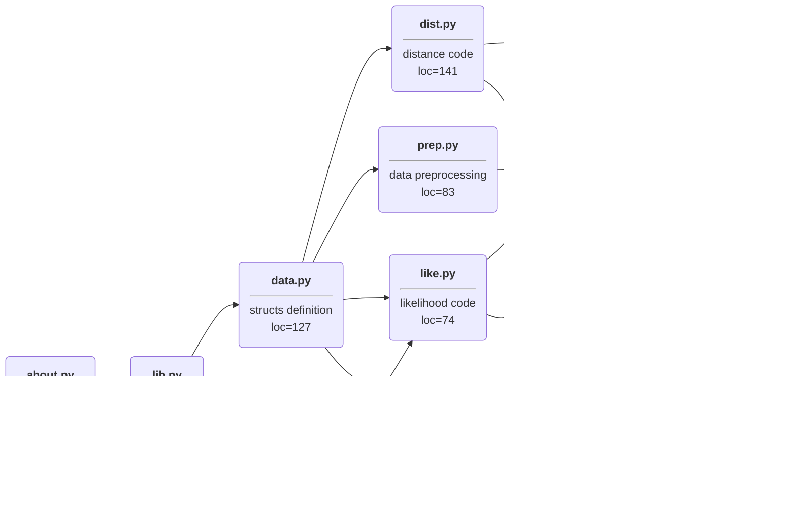

File imports and code size (Aug 11, 2025).

```mermaid
graph LR;
lib(<b>lib.py</b><hr>misc code<br>loc=82);
about(<b>about.py</b><hr>config control<br>loc=22);
data(<b>data.py</b><hr>structs definition<br>loc=127)
dist(<b>dist.py</b><hr>distance code<br>loc=141);
like(<b>like.py</b><hr>likelihood code<br>loc=74);
likely(<b>likely.py</b><hr>incremental learning<br>loc=126);
prep(<b>prep.py</b><hr>data preprocessing<br>loc=83);
tm(<b>tm.py</b><hr>text mining ex<br>loc=96);
rq(<b>rq.py</b><hr>experiments<br>loc=35);
stats(<b>stats.py</b><hr>stats code<br>loc=151);
tree(<b>tree.py</b><hr>tree generation<br>loc=90);

lib --> data;
stats --> like;
stats --> rq;
data --> dist;
data --> prep;
about --> lib;
data --> like;
dist --> likely;
like --> likely;
like --> tm;
prep --> tm;
lib --> stats;
data --> tree;
dist --> tree;
tree --> rq;
likely --> rq;
```

