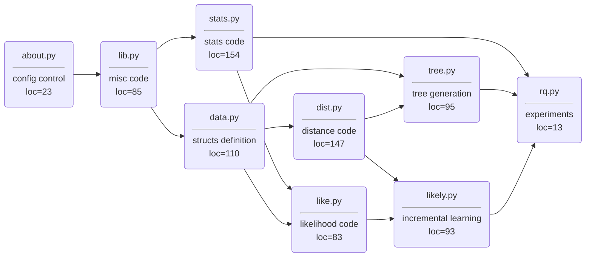

File imports and code size (Aug1, 2025).

```mermaid
graph LR;
lib(lib.py<hr>misc code<br>loc=85);
about(about.py<hr>config control<br>loc=23);
data(data.py<hr>structs definition<br>loc=110)
dist(dist.py<hr>distance code<br>loc=147);
like(like.py<hr>likelihood code<br>loc=83);
likely(likely.py<hr>incremental learning<br>loc=93);
rq(rq.py<hr>experiments<br>loc=13);
stats(stats.py<hr>stats code<br>loc=154);
tree(tree.py<hr>tree generation<br>loc=95);
lib --> data;
stats --> like;
stats --> rq;
data --> dist;
about --> lib;
data --> like;
dist --> likely;
like --> likely;
lib --> stats;
data --> tree;
dist --> tree;
tree --> rq;
likely --> rq;
```

