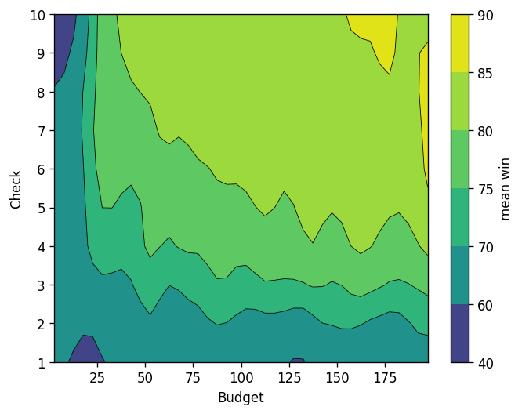
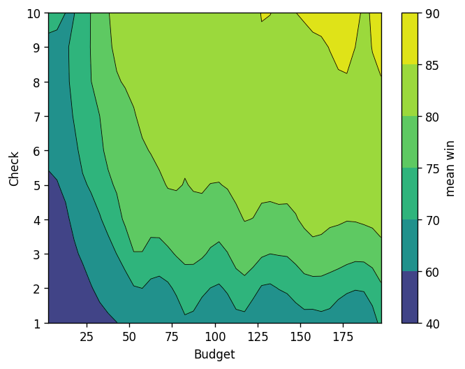
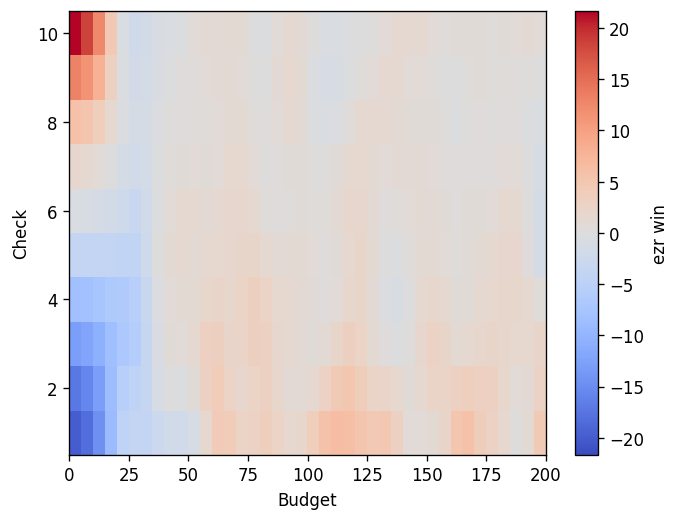
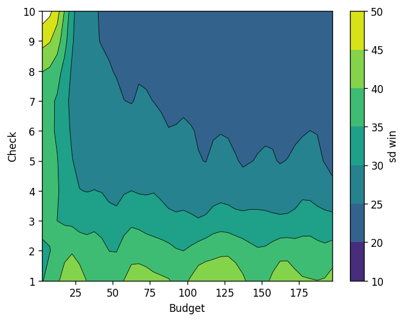
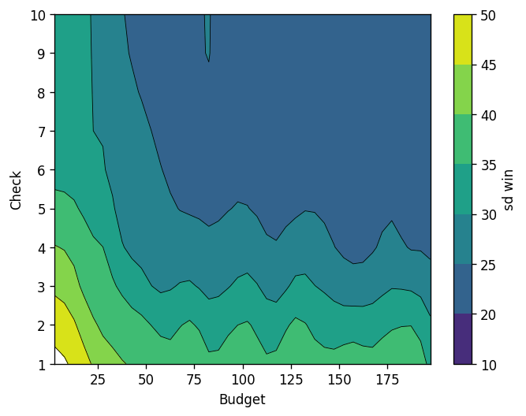
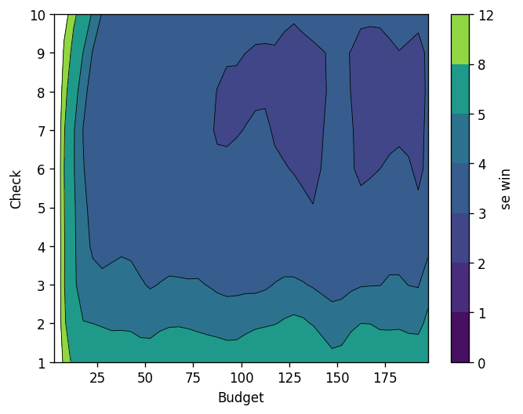

# rq: research questions for ezr/ezr0

Data: `rq.py`; each run draws a random moot/optimize dataset,
Budget (10..200 labels), Check (1..10 test probes); score = win
(100 = found the best row, 0 = no better than average).

## RQ1: how much does a labelling budget buy?

25,000 paired runs per algorithm (pypy3.12, 10-way xargs, ~5
min/arm).

**Fig 1: ezr0** (whole budget spent at random, up front)

**Fig 2: ezr** (one label picked after each label)

**Fig 3: ezr minus ezr0** (red: ezr wins; blue: ezr0 wins)

- **Check dominates Budget.** Win climbs steeply with Check
  everywhere; past Budget ~50, more labels barely help.
- **Very little delta ezr vs ezr0.** Over most of the map the
  difference is within noise (±3 wins). Sequential labelling
  buys nothing once labels are even modestly plentiful.
- Both exceptions sit at Budget < 25: ezr wins (+20) at Check
  9..10; ezr0 wins (-20) at Check 1..5. Active learning only
  pays when labels are very scarce, and hurts there if too few
  checks are held back.

### RQ1a: how stable are these wins?

**Fig 4, 5: sd of win** (ezr0, ezr); **Fig 6: se of the mean**

- **The means are solid.** Standard error is 2..5 wins almost
  everywhere (Fig 6), so the 5-win contour steps of Figs 1..2
  are resolved; more runs would change nothing.
- **The spread is real, and it mirrors the mean.** Run-to-run
  sd is 20..25 on the high-win plateau but 40..50 in the
  label-starved corner: low-budget runs are not just worse on
  average, they are lottery tickets. Most of that sd is
  dataset heterogeneity (per-dataset means run 60..100), not
  sampling noise.

## RQ2: what do interpreter, parallelism, and algorithm cost?

500 runs per cell (small, so fixed costs understate the
parallel gain; at 25,000 runs xargs-10 gave ~5x).

|               | python3 | pypy3.12 |
|---------------|---------|----------|
| ezr0 serial   |   94.9s |    23.4s |
| ezr0 xargs-10 |   37.5s |     9.8s |
| ezr serial    |  117.0s |    29.9s |
| ezr xargs-10  |   42.7s |    11.9s |

- pypy3.12 ~4x over python3; xargs-10 ~2.5x here (more at
  scale); ezr0 ~1.2x cheaper than ezr.
- Worst to best, (serial, python3, ezr) to (xargs-10,
  pypy3.12, ezr0): **12x** (117.0s to 9.8s).

## Conclusion

Label a few dozen rows any way at all, hold back a handful of
checks, and pick on validation: that simple recipe matches the
clever one except in the label-starved corner (RQ1). And the
whole study is cheap: pypy plus ten processes turns an
afternoon of compute into minutes (RQ2).
